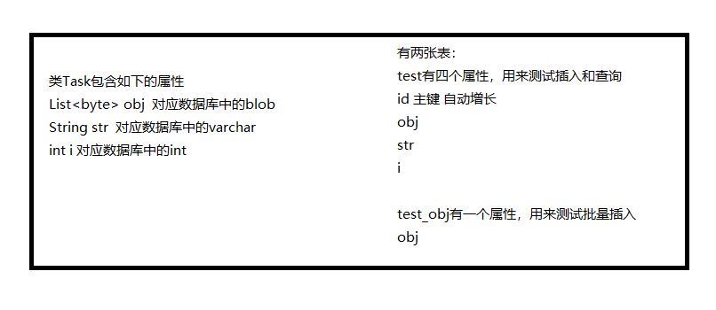

# MySql数据库操作实例
本项目是使用c3p0连接池的一个mysql实例


## 引入依赖
```xml
<dependency>
	<groupId>c3p0</groupId>
	<artifactId>c3p0</artifactId>
	<version>0.9.1.2</version>
</dependency>
<dependency>
	<groupId>mysql</groupId>
	<artifactId>mysql-connector-java</artifactId>
	<version>6.0.6</version>
</dependency>
```

## 建库建表
加入mysql命令行
```bash
mysql> source 指向项目下的create_database_table.sql的路径
```
## 插入数据
```bash
mvn test -Dtest=MysqlHelperTest#saveTaskTest
```

## 查询数据
```bash
mvn test -Dtest=MysqlHelperTest#getTaskTest
```